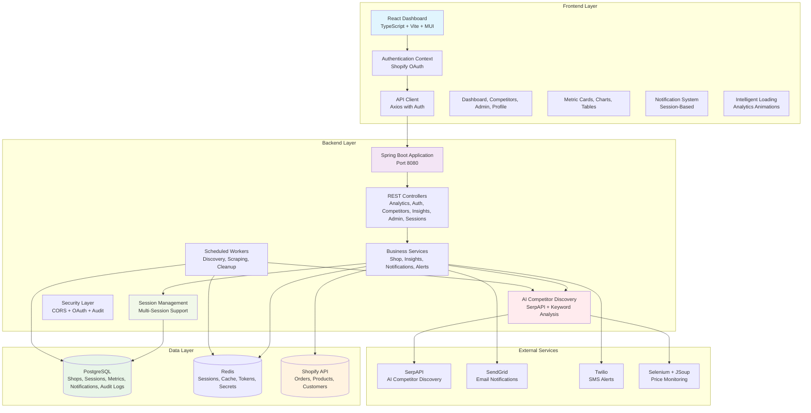
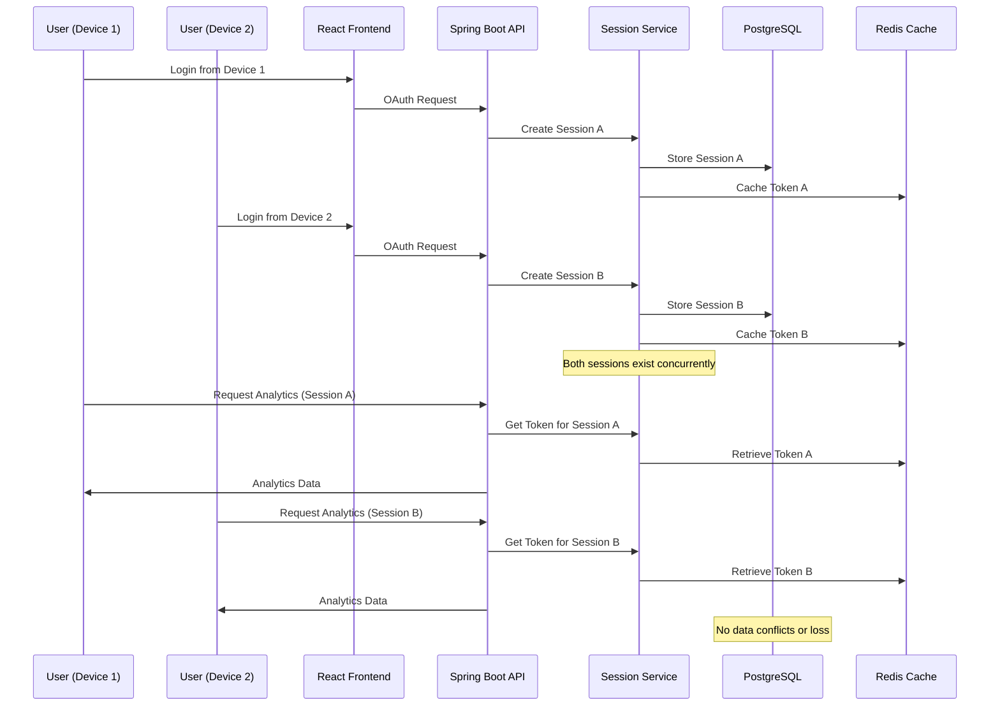

# ShopGauge - Advanced Shopify Analytics & Competitor Intelligence Platform

[](https://opensource.org/licenses/Apache-2.0)
[](https://openjdk.java.net/projects/jdk/17/)
[](https://spring.io/projects/spring-boot)
[](https://reactjs.org/)
[](https://www.typescriptlang.org/)
[](https://www.postgresql.org/)
[](https://redis.io/)

ShopGauge is a comprehensive, enterprise-grade analytics and competitor intelligence platform designed specifically for
Shopify merchants. It provides AI-powered revenue forecasting, professional shareable charts, 9 advanced chart types, intelligent data visualization, automated competitor discovery, and enterprise-grade team collaboration with comprehensive compliance features.

## 🚀 Key Features

### 🔮 **AI-Powered Predictive Analytics**

- **Revenue Forecasting**: Advanced AI algorithms predict revenue trends 7-60 days ahead with confidence intervals and statistical accuracy
- **Order Prediction**: Intelligent forecasting for order volumes and conversion rates with trend analysis
- **9 Advanced Chart Types**: Line, Area, Bar, Candlestick, Waterfall, Stacked, Composed, Combined, and Revenue-Focus charts
- **Intelligent Color Separation**: Visual distinction between historical data (blue/green/amber) and forecast data (purple/pink/orange)
- **Professional Chart Templates**: Executive, Investor, Marketing, Social Celebration, and Minimal Professional templates
- **High-Resolution Exports**: PNG, PDF, and social media-ready formats with automated branding
- **Social Media Integration**: Direct sharing to LinkedIn, Twitter, and Email with auto-generated professional messaging
- **Confidence Intervals**: Statistical confidence bands and prediction accuracy metrics for informed decision making

### 🤖 **AI-Powered Intelligence**

- **Smart Competitor Discovery**: AI-driven competitor identification using SerpAPI and intelligent keyword analysis
- **Automated Suggestion Engine**: Machine learning algorithms suggest relevant competitors based on product categories and keywords
- **Intelligent Insights**: Context-aware analytics insights with actionable recommendations
- **Predictive Analytics**: Revenue forecasting and trend analysis with intelligent pattern recognition
- **Automated Alerts**: Smart notification system that learns from user behavior patterns

### 📊 **Advanced Analytics Dashboard**

- **Unified Analytics & Real-Time Revenue Tracking**: Live sales data with 9 chart types (Area, Bar, Candlestick, Waterfall, Stacked, Composed, Line, Combined, Revenue-Focus) plus AI-powered 7-60 day forecasts with confidence bands
- **Professional Shareable Charts**: Export charts as high-resolution PNG images or professional PDF reports with branded templates
- **Enhanced Mobile Experience**: Optimized chart loading and responsive design for seamless mobile analytics
- **Intelligent Data Visualization**: Clear color separation between historical and forecast data for intuitive insights
- **Conversion Rate Optimization**: Detailed conversion funnel analysis with industry benchmarks and predictive modeling
- **Inventory Intelligence**: Low stock alerts, product performance metrics, and demand forecasting with AI predictions
- **Abandoned Cart Recovery**: Automated detection and recovery strategies for abandoned carts with predictive analytics
- **Customer Behavior Analytics**: Anonymous customer journey mapping and segmentation with trend analysis
- **Intelligent Caching**: 120-minute cache duration with debounced refresh controls for optimal performance

### 🔄 **Multi-Session Architecture**

- **Concurrent Access**: Multiple team members can work simultaneously from different devices/browsers
- **Session Isolation**: Each session maintains independent access tokens and private notifications
- **Smart Session Management**: Automatic session cleanup, expiration handling, and conflict resolution
- **Device Tracking**: Comprehensive session monitoring with IP address and user agent tracking
- **Team Collaboration**: No data conflicts when multiple users access the same store
- **Fallback Mechanisms**: Graceful degradation ensures continuous service even during session issues

### 📈 **Professional Sharing & Collaboration**

- **Executive Chart Templates**: Professional layouts designed for C-suite presentations and board meetings
- **Investor Update Templates**: Growth-focused designs optimized for stakeholder reports and funding presentations
- **Marketing Insights Templates**: Data-driven layouts perfect for marketing team analysis and campaign planning
- **Social Media Integration**: One-click sharing to LinkedIn, Twitter, and Email with auto-generated professional messaging
- **High-Resolution Exports**: PNG images (2x scale) and professional PDF reports with company branding
- **Privacy Controls**: Granular data anonymization and sharing permissions with audit logging
- **Real-Time Export Progress**: Visual progress indicators and comprehensive error handling for reliable exports
- **Mobile-Optimized Sharing**: Seamless sharing experience across all devices and platforms

### 🎯 **Competitor Intelligence**

- **Automated Competitor Discovery**: AI-powered competitor identification using SerpAPI integration
- **Real-time Price Monitoring**: Continuous price tracking across competitor websites with Selenium-based scraping
- **Market Position Analysis**: Competitive landscape insights and positioning strategies
- **Suggestion Management**: Curated competitor suggestions with approval workflow
- **Web Scraping**: Automated data collection from competitor sites using advanced scraping techniques
- **Competitive Alerts**: Instant notifications for price changes and market movements

### 🔔 **Advanced Notification System**

- **Session-Based Notifications**: Private notifications isolated to specific user sessions
- **Multi-Channel Delivery**: Email (SendGrid) and SMS (Twilio) notification support
- **Smart Notification Scoping**: Shop-level and session-level notification isolation
- **Real-time Updates**: Instant in-app notifications with React Hot Toast integration
- **Notification History**: Complete audit trail of all notifications sent
- **Customizable Alerts**: User-configurable notification preferences and thresholds

### 🔒 **Enterprise Security & Compliance**

- **GDPR/CCPA Compliance**: Full data privacy compliance with automatic data retention policies
- **Shopify Protected Data**: Compliant with Shopify's Protected Customer Data requirements
- **Comprehensive Audit Logging**: Complete audit trail with 365-day retention for compliance monitoring
- **Multi-Layer Encryption**: AES-256 encryption at rest, TLS 1.3 in transit
- **Data Minimization**: Only essential data processed for analytics
- **Session Security**: Advanced session management with automatic cleanup and expiration

### 🎨 **Enhanced User Experience**

- **Intelligent Loading Screen**: Beautiful, analytics-themed loading experience with progress indication
- **Mobile-First Design**: Responsive design with hamburger menu and touch-optimized controls
- **Smart 404 Handling**: Engaging 404 page with analytics animations and intelligent redirects
- **Debounced Controls**: Smart refresh controls that prevent API abuse and improve performance
- **Progressive Web App**: Optimized for mobile devices with offline support capabilities
- **Accessibility Compliance**: WCAG-compliant design with screen reader support

### 🔧 **Developer Experience**

- **Modern Tech Stack**: Spring Boot 3.2.3, React 18, TypeScript, PostgreSQL, Redis
- **Comprehensive Testing**: Unit tests, integration tests, and end-to-end testing
- **Docker Containerization**: Production-ready Docker setup with docker-compose
- **API-First Design**: RESTful APIs with comprehensive documentation
- **Reactive Architecture**: WebFlux-based reactive programming for scalability
- **Automated Database Migrations**: Flyway-based database versioning and migration management

## 🏗️ Architecture Overview

### System Architecture



## 🔄 Multi-Session Architecture

### Session Management Flow



## 🔌 API Architecture

### Core Endpoints

| Endpoint                           | Method          | Purpose                             | Authentication |
|------------------------------------|-----------------|-------------------------------------|----------------|
| `/api/auth/shopify/install`        | GET             | Initiate OAuth flow                 | None           |
| `/api/auth/shopify/callback`       | GET             | Handle OAuth callback               | None           |
| `/api/auth/shopify/reauth`         | GET             | Re-authenticate with updated scopes | Cookie         |
| `/api/auth/shopify/me`             | GET             | Get current shop info               | Cookie         |
| `/api/sessions/active`             | GET             | Get all active sessions             | Cookie         |
| `/api/sessions/current`            | GET             | Get current session info            | Cookie         |
| `/api/sessions/terminate`          | POST            | Terminate specific session          | Cookie         |
| `/api/sessions/health`             | GET             | Session health check                | Cookie         |
| `/api/analytics/orders/timeseries` | GET             | Orders data with pagination         | Cookie         |
| `/api/analytics/revenue`           | GET             | Revenue metrics                     | Cookie         |
| `/api/analytics/revenue/timeseries`| GET             | Revenue timeseries data             | Cookie         |
| `/api/analytics/abandoned_carts`   | GET             | Abandoned cart analytics            | Cookie         |
| `/api/analytics/conversion`        | GET             | Conversion rate metrics             | Cookie         |
| `/api/analytics/inventory/low`     | GET             | Low inventory items                 | Cookie         |
| `/api/analytics/new_products`      | GET             | Recently added products             | Cookie         |
| `/api/analytics/permissions/check` | GET             | Check API permissions               | Cookie         |
| `/api/analytics/audit-logs`        | GET             | View audit logs for compliance      | Cookie         |
| `/api/competitors`                 | GET/POST/DELETE | Competitor management               | Cookie         |
| `/api/competitors/suggestions`     | GET/POST/DELETE | AI competitor discovery suggestions | Cookie         |
| `/api/insights`                    | GET             | AI-powered dashboard insights       | Cookie         |
| `/api/admin/debug`                 | GET             | Debug API access issues             | Cookie         |
| `/api/admin/secrets`               | GET/POST/DELETE | Manage encrypted secrets            | Cookie         |
| `/api/admin/integrations/status`   | GET             | Check integration status            | Cookie         |
| `/api/admin/integrations/test`     | POST            | Test email/SMS integrations         | Cookie         |

### Advanced Features

- 🔍 **Comprehensive Error Codes** - Detailed error responses with resolution guidance
- 📊 **Permission Validation** - Real-time API access validation and scope checking
- 🔄 **Automatic Retry Logic** - Intelligent retry with exponential backoff
- 📝 **Audit Trail** - Complete PostgreSQL-based audit logging with 365-day retention
- 🛡️ **Privacy Compliance** - GDPR/CCPA compliant data processing and retention
- 🔧 **Debug Endpoints** - Built-in troubleshooting tools for API access issues

## 🗄️ Database Schema

### Enhanced Schema with Multi-Session Support

```sql
-- Shops table for store management
CREATE TABLE shops (
    id BIGSERIAL PRIMARY KEY,
    shopify_domain VARCHAR(255) NOT NULL UNIQUE,
    access_token VARCHAR(500), -- Fallback token
    created_at TIMESTAMP WITH TIME ZONE DEFAULT CURRENT_TIMESTAMP,
    updated_at TIMESTAMP WITH TIME ZONE DEFAULT CURRENT_TIMESTAMP
);

-- Shop sessions table for multi-session support
CREATE TABLE shop_sessions (
    id BIGSERIAL PRIMARY KEY,
    shop_id BIGINT NOT NULL,
    session_id VARCHAR(255) NOT NULL UNIQUE,
    access_token VARCHAR(500) NOT NULL,
    user_agent TEXT,
    ip_address VARCHAR(45),
    created_at TIMESTAMP WITH TIME ZONE DEFAULT CURRENT_TIMESTAMP,
    updated_at TIMESTAMP WITH TIME ZONE DEFAULT CURRENT_TIMESTAMP,
    last_accessed_at TIMESTAMP WITH TIME ZONE DEFAULT CURRENT_TIMESTAMP,
    expires_at TIMESTAMP WITH TIME ZONE,
    is_active BOOLEAN DEFAULT TRUE,
    CONSTRAINT fk_shop_sessions_shop FOREIGN KEY (shop_id) REFERENCES shops(id) ON DELETE CASCADE
);

-- Notifications table with session support
CREATE TABLE notifications (
    id BIGSERIAL PRIMARY KEY,
    shop_id BIGINT NOT NULL REFERENCES shops(id) ON DELETE CASCADE,
    session_id VARCHAR(255) REFERENCES shop_sessions(session_id) ON DELETE CASCADE,
    type VARCHAR(50) NOT NULL,
    title VARCHAR(255) NOT NULL,
    message TEXT NOT NULL,
    data JSONB,
    is_read BOOLEAN DEFAULT FALSE,
    scope VARCHAR(20) DEFAULT 'SESSION',
    created_at TIMESTAMP WITH TIME ZONE DEFAULT CURRENT_TIMESTAMP,
    deleted_at TIMESTAMP WITH TIME ZONE
);

-- Competitor suggestions with AI discovery
CREATE TABLE competitor_suggestions (
    id BIGSERIAL PRIMARY KEY,
    shop_id BIGINT NOT NULL REFERENCES shops(id) ON DELETE CASCADE,
    product_id BIGINT NOT NULL,
    suggested_url TEXT NOT NULL,
    title VARCHAR(255),
    price NUMERIC(12,2),
    source VARCHAR(50) NOT NULL DEFAULT 'GOOGLE_SHOPPING',
    discovered_at TIMESTAMP WITH TIME ZONE DEFAULT CURRENT_TIMESTAMP,
    status VARCHAR(20) NOT NULL DEFAULT 'NEW',
    confidence_score NUMERIC(3,2) DEFAULT 0.0,
    keywords TEXT[],
    UNIQUE(shop_id, product_id, suggested_url)
);

-- Comprehensive audit logs for compliance
CREATE TABLE audit_logs (
    id BIGSERIAL PRIMARY KEY,
    shop_id BIGINT REFERENCES shops(id),
    session_id VARCHAR(255),
    action VARCHAR(100) NOT NULL,
    category VARCHAR(50) NOT NULL DEFAULT 'SYSTEM',
    details TEXT,
    user_agent VARCHAR(500),
    ip_address VARCHAR(255),
    created_at TIMESTAMP WITH TIME ZONE DEFAULT CURRENT_TIMESTAMP,
    INDEX idx_audit_logs_shop_id (shop_id),
    INDEX idx_audit_logs_created_at (created_at)
);
```

## 🚀 Quick Start

### Prerequisites

- **Java 17** or higher
- **Node.js 18** or higher  
- **PostgreSQL 15+** or higher (PostgreSQL 16 recommended for production)
- **Redis 7** or higher
- **Shopify Partner Account** with app credentials and API access
- **Docker** (optional, for containerized development)

### Local Development Setup

1. **Clone the repository**
   ```bash
   git clone https://github.com/teja230/shopgauge.git
   cd shopgauge
   ```

2. **Set up environment variables**
   ```bash
   cp config/.env.example .env
   # Edit .env with your actual values
   ```

3. **Start PostgreSQL and Redis**
   ```bash
   # Using Docker
   docker run -d --name postgres -e POSTGRES_PASSWORD=storesight -p 5432:5432 postgres:15
   docker run -d --name redis -p 6379:6379 redis:7
   ```

4. **Run database migrations**
```bash
cd backend
   ./gradlew flywayMigrate
   ```

5. **Start the backend**
   ```bash
   cd backend
./gradlew bootRun
```

6. **Start the frontend**
```bash
cd frontend
npm install
npm run dev
```

7. **Access the local development environment**
   - Frontend: http://localhost:5173
   - Backend API: http://localhost:8080

## 🌐 Live Demo

Try the live application without any setup:

- **Frontend**: [https://www.shopgaugeai.com](https://www.shopgaugeai.com)
- **Backend API**: [https://api.shopgaugeai.com](https://api.shopgaugeai.com)

### Environment Variables for Local Development

Required environment variables for local development (see `docs/ENVIRONMENT_SETUP.md` for details):

```bash
# Database (Local Development)
DB_URL=jdbc:postgresql://localhost:5432/storesight
DB_USER=storesight
DB_PASS=storesight

# Redis (Local Development)
REDIS_HOST=localhost
REDIS_PORT=6379

# Shopify (Required - Get from your Shopify Partner account)
SHOPIFY_API_KEY=your_shopify_api_key
SHOPIFY_API_SECRET=your_shopify_api_secret
SHOPIFY_REDIRECT_URI=http://localhost:8080/api/auth/shopify/callback

# AI & External Services
SERPAPI_KEY=your_serpapi_key          # For AI competitor discovery
SENDGRID_API_KEY=your_sendgrid_key    # For email notifications
TWILIO_ACCOUNT_SID=your_twilio_sid    # For SMS alerts
TWILIO_AUTH_TOKEN=your_twilio_token   # For SMS alerts
```

> **💡 Tip**: Want to try ShopGauge without local setup? Use our [live demo](https://www.shopgaugeai.com) instead!

## 🧪 Testing

### Backend Testing
```bash
cd backend
./gradlew test
```

### Frontend Testing
```bash
cd frontend
npm run test
```

### Integration Testing
```bash
# Run with test containers
./gradlew integrationTest
```

## 🚀 Deployment

### Docker Deployment

1. **Build the application**
   ```bash
   docker-compose build
   ```

2. **Deploy with Docker Compose**
   ```bash
   docker-compose up -d
   ```

### Cloud Deployment

The application is production-ready with comprehensive cloud deployment support:

- **Database**: PostgreSQL 15+ with automated migrations
- **Cache**: Redis 7+ for session management and caching
- **Secrets**: Environment variable based secret management
- **Monitoring**: Built-in health checks and debug endpoints
- **Scaling**: Reactive architecture supports horizontal scaling
- **Security**: Production-grade security with comprehensive audit logging

## 🔒 Security Features

### Enterprise-Grade Security

- **Multi-Session Management** - Secure concurrent access from multiple devices
- **Token Isolation** - Independent access tokens per session
- **Comprehensive Audit Logging** - Complete activity tracking with 365-day retention
- **Data Encryption** - AES-256 at rest, TLS 1.3 in transit
- **GDPR/CCPA Compliance** - Built-in data protection and privacy controls
- **Session Security** - Automatic cleanup, expiration, and conflict resolution
- **IP Tracking** - Comprehensive session monitoring and device tracking

### Compliance Features

- **Data Minimization** - Only essential data processed for analytics
- **Privacy Controls** - User-controlled data export and deletion
- **Audit Trail** - Complete compliance monitoring with detailed logs
- **Protected Data Handling** - Shopify Protected Customer Data compliant
- **Retention Policies** - Automated data retention with configurable policies

## 📊 Analytics & Insights

### Advanced Analytics Capabilities

- **7 Chart Types** - Area, Bar, Candlestick, Waterfall, Stacked, Composed, Line charts
- **Real-time Data Processing** - Live analytics with intelligent caching (120-minute duration)
- **AI-Powered Insights** - Context-aware recommendations with machine learning
- **Predictive Analytics** - Revenue forecasting and trend analysis
- **Performance Metrics** - Comprehensive dashboard with KPI tracking
- **Conversion Optimization** - Detailed funnel analysis with industry benchmarks

### Intelligent Features

- **Smart Caching** - 120-minute cache with debounced refresh controls
- **Automated Competitor Discovery** - AI-powered suggestions using SerpAPI
- **Predictive Insights** - Machine learning-based trend analysis
- **Anomaly Detection** - Automatic detection of unusual patterns
- **Performance Optimization** - Intelligent query optimization and data processing

## 🤝 Contributing

We welcome contributions! Please see our [Contributing Guide](docs/CONTRIBUTING.md) for details on:

- Development setup and workflow
- Code style and standards
- Testing requirements
- Pull request process
- Issue reporting guidelines

## 📚 Documentation

### Technical Documentation

- **[Multi-Session Architecture](docs/MULTI_SESSION_ARCHITECTURE.md)** - Detailed architecture documentation
- **[Notification System](docs/NOTIFICATIONS_SYSTEM.md)** - Comprehensive notification system documentation (session-based, global settings, frontend/backend integration)
- **[Environment Setup](docs/ENVIRONMENT_SETUP.md)** - Complete setup guide
- **[Contributing Guide](docs/CONTRIBUTING.md)** - Development guidelines
- **[Privacy Policy](docs/PRIVACY_POLICY.md)** - Data handling and privacy compliance
- **[Shopify Protected Data Request](docs/SHOPIFY_PROTECTED_DATA_REQUEST.md)** - Shopify compliance documentation

### Enhancement Documentation

- **[Authentication UI Fixes](docs/AUTHENTICATION_UI_FIXES.md)** - Authentication and UI improvements
- **[Dashboard Loading Fixes](docs/DASHBOARD_LOADING_FIXES.md)** - Dashboard performance and loading optimizations
- **[OAuth Database Fixes](docs/OAUTH_DATABASE_FIXES.md)** - OAuth and database improvements
- **[Market Intelligence](docs/MARKET_INTELLIGENCE.md)** - Competitor discovery and market analysis features

## 🔮 Roadmap

### Upcoming Features

- **Advanced AI Analytics** - Machine learning-based predictive insights
- **Team Management** - Multi-user access with role-based permissions
- **Advanced Integrations** - More third-party service integrations
- **Mobile App** - Native mobile application for iOS and Android
- **API Expansion** - GraphQL API and webhook support
- **Advanced Reporting** - Customizable reports and dashboards

### Performance Improvements

- **Enhanced Caching** - Multi-layer caching strategies
- **Real-time Updates** - WebSocket integration for live data
- **Progressive Web App** - Offline support and push notifications
- **Advanced Monitoring** - Real-time performance metrics and alerting

## 📄 License

This project is licensed under the Apache License 2.0 - see the [LICENSE](LICENSE) file for details.

## 🆘 Support

- **Issues**: [GitHub Issues](https://github.com/teja230/shopgauge/issues)
- **Discussions**: [GitHub Discussions](https://github.com/teja230/shopgauge/discussions)
- **Email**: support@shopgaugeai.com
- **Documentation**: [Technical Docs](docs/)

---

**ShopGauge** - Built with ❤️ for Shopify merchants who want intelligent analytics and competitor insights. 🚀