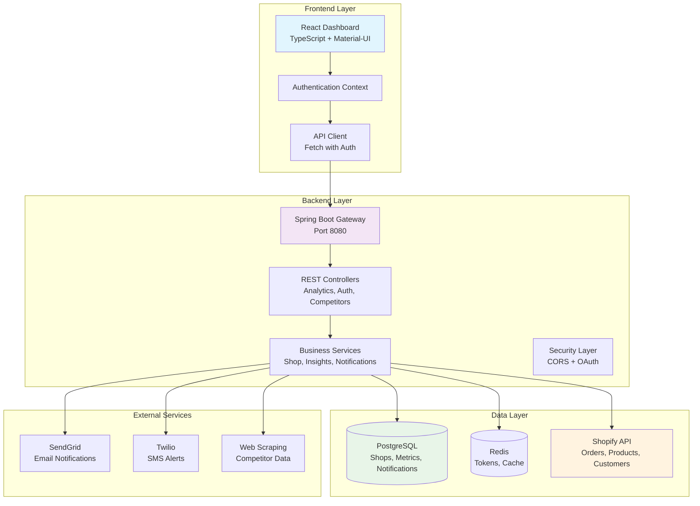
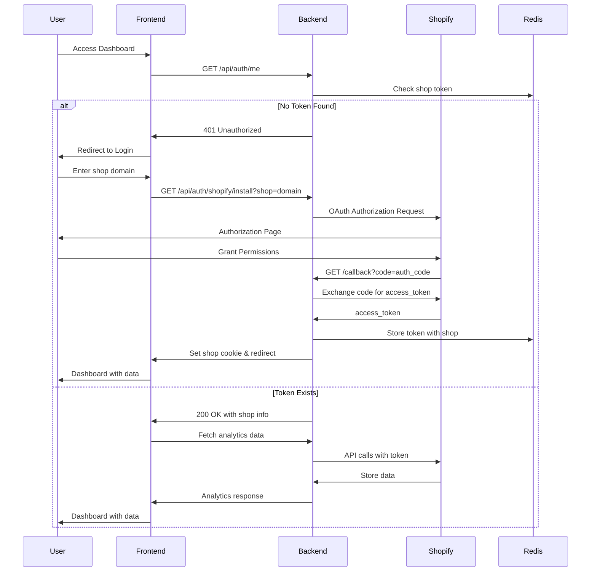
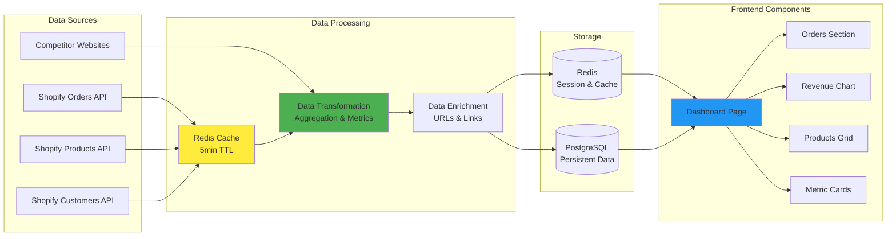
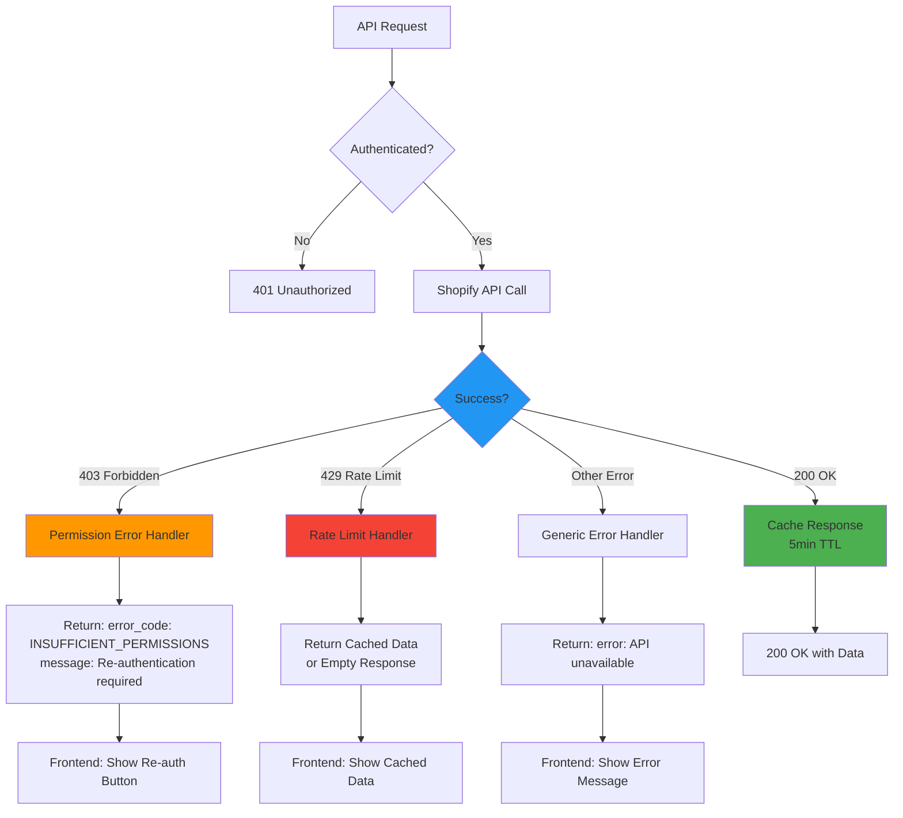

# StoreSight - Shopify Analytics Dashboard

StoreSight is a modern, real-time analytics dashboard for Shopify stores that provides comprehensive insights,
competitor tracking, and automated reporting with seamless Shopify integration.

## 🏗️ Architecture Overview

### System Architecture



## 🔄 Authentication Flow

### Shopify OAuth Integration



## 📊 Data Flow Architecture

### Real-time Analytics Pipeline



## 🔌 API Architecture

### Core Endpoints

| Endpoint                           | Method          | Purpose                             | Authentication |
|------------------------------------|-----------------|-------------------------------------|----------------|
| `/api/auth/shopify/install`        | GET             | Initiate OAuth flow                 | None           |
| `/api/auth/shopify/callback`       | GET             | Handle OAuth callback               | None           |
| `/api/auth/shopify/reauth`         | GET             | Re-authenticate with updated scopes | Cookie         |
| `/api/auth/me`                     | GET             | Get current shop info               | Cookie         |
| `/api/analytics/orders/timeseries` | GET             | Orders data with pagination         | Cookie         |
| `/api/analytics/revenue`           | GET             | Revenue metrics                     | Cookie         |
| `/api/analytics/products`          | GET             | Product performance                 | Cookie         |
| `/api/analytics/inventory/low`     | GET             | Low inventory items                 | Cookie         |
| `/api/analytics/new_products`      | GET             | Recently added products             | Cookie         |
| `/api/analytics/permissions/check` | GET             | Check API permissions               | Cookie         |
| `/api/competitors`                 | GET/POST/DELETE | Competitor management               | Cookie         |
| `/api/insights`                    | GET             | Dashboard insights                  | Cookie         |

### Error Handling & Permission Management



## 🛠️ Technology Stack

### Frontend

- **Framework**: React 18 with TypeScript
- **UI Library**: Material-UI (MUI) v5
- **Routing**: React Router v6
- **Charts**: Recharts
- **HTTP Client**: Fetch API with authentication wrapper
- **Build Tool**: Vite
- **Development**: Hot reload, TypeScript checking

### Backend

- **Framework**: Spring Boot 3.x
- **Language**: Java 17+
- **Web**: Spring WebFlux (Reactive)
- **Security**: Spring Security with OAuth2
- **Database**: Spring Data JPA with PostgreSQL
- **Caching**: Spring Data Redis
- **Build Tool**: Gradle
- **API Documentation**: OpenAPI/Swagger

### Infrastructure

- **Database**: PostgreSQL 14+
- **Cache**: Redis 6+
- **Deployment**: Docker containers
- **Monitoring**: Spring Actuator
- **Logging**: SLF4J with Logback

## ✨ Features

### Core Analytics

- 📈 **Real-time Revenue Tracking** - Live revenue metrics and trends
- 📦 **Order Analytics** - Order volume, trends, and customer insights
- 🛍️ **Product Performance** - Top products, sales metrics, inventory levels
- 📊 **Interactive Dashboards** - Responsive charts and visualizations
- 🔄 **Automatic Data Sync** - Real-time synchronization with Shopify

### Advanced Features

- 🏪 **Competitor Tracking** - Monitor competitor prices and products
- 📧 **Automated Alerts** - Email/SMS notifications for key events
- 📋 **Custom Reports** - Scheduled reports and data exports
- 🔍 **Low Inventory Alerts** - Proactive inventory management
- 📱 **Mobile Responsive** - Full mobile and tablet support

### Integration Features

- 🔐 **Shopify OAuth** - Secure authentication with proper scopes
- 🔄 **Permission Management** - Graceful handling of API limitations
- 💾 **Smart Caching** - Redis caching for improved performance
- 🛡️ **Error Handling** - Comprehensive error recovery and user guidance
- 🔗 **Deep Links** - Direct links to Shopify admin pages

## 🚀 Quick Start

### Prerequisites

- **Java 17+** (for backend)
- **Node.js 18+** (for frontend)
- **PostgreSQL 14+** (for database)
- **Redis 6+** (for caching)
- **Shopify Partner Account** (for API credentials)

### 1. Clone Repository

```bash
git clone https://github.com/your-org/storesight.git
cd storesight
```

### 2. Backend Setup

```bash
cd backend

# Configure application properties
cp src/main/resources/application.properties.example src/main/resources/application.properties

# Edit application.properties with your settings:
# - Database connection
# - Redis connection  
# - Shopify API credentials
# - External service keys

# Build and run
./gradlew bootRun
```

### 3. Frontend Setup

```bash
cd frontend

# Install dependencies
npm install

# Configure environment
cp .env.example .env

# Edit .env with your settings:
# VITE_API_BASE_URL=http://localhost:8080

# Start development server
npm run dev
```

### 4. Database Setup

```bash
# Create database
createdb storesight

# Run migrations (handled automatically by Flyway)
# Migrations are in: backend/src/main/resources/db/migration/
```

## 📝 Configuration

### Backend Configuration (`application.properties`)

```properties
# Database
spring.datasource.url=jdbc:postgresql://localhost:5432/storesight
spring.datasource.username=your_db_user
spring.datasource.password=your_db_password
# Redis
spring.data.redis.host=localhost
spring.data.redis.port=6379
# Shopify API
shopify.api.key=your_shopify_api_key
shopify.api.secret=your_shopify_api_secret
shopify.scopes=read_products,read_orders,read_customers,read_inventory
shopify.redirect_uri=http://localhost:8080/api/auth/shopify/callback
# External Services
sendgrid.api-key=your_sendgrid_key
twilio.account_sid=your_twilio_sid
twilio.auth_token=your_twilio_token
```

### Frontend Configuration (`.env`)

```env
VITE_API_BASE_URL=http://localhost:8080
VITE_APP_NAME=StoreSight
```

## 🔧 Development

### Running in Development Mode

```bash
# Terminal 1: Backend
cd backend && ./gradlew bootRun

# Terminal 2: Frontend  
cd frontend && npm run dev

# Terminal 3: Database (if using Docker)
docker run --name storesight-postgres -e POSTGRES_DB=storesight -e POSTGRES_USER=storesight -e POSTGRES_PASSWORD=storesight -p 5432:5432 -d postgres:14

# Terminal 4: Redis (if using Docker)
docker run --name storesight-redis -p 6379:6379 -d redis:6
```

### Building for Production

```bash
# Backend
cd backend
./gradlew build
java -jar build/libs/storesight-backend-*.jar

# Frontend
cd frontend
npm run build
# Serve the dist/ directory with your web server
```

## 📚 API Documentation

### Shopify Integration

The application integrates with Shopify using OAuth 2.0 and requires the following scopes:

- `read_products` - Access product catalog
- `read_orders` - Access order history
- `read_customers` - Access customer data
- `read_inventory` - Access inventory levels

### Rate Limiting

- Shopify API: 40 requests per app per store per minute
- Application implements intelligent caching and request batching
- Graceful degradation when rate limits are exceeded

### Error Codes

| Code                       | Description                         | Resolution                                     |
|----------------------------|-------------------------------------|------------------------------------------------|
| `INSUFFICIENT_PERMISSIONS` | Missing Shopify API scopes          | Re-authenticate via `/api/auth/shopify/reauth` |
| `RATE_LIMITED`             | Shopify API rate limit exceeded     | Wait and retry, cached data served             |
| `SHOPIFY_UNAVAILABLE`      | Shopify API temporarily unavailable | Cached data served, retry automatically        |

## 🚢 Deployment

### Docker Deployment

```bash
# Build images
docker-compose build

# Run services
docker-compose up -d

# View logs
docker-compose logs -f
```

### Production Checklist

- [ ] Configure production database
- [ ] Set up Redis cluster
- [ ] Configure HTTPS/SSL
- [ ] Set production Shopify app credentials
- [ ] Configure monitoring and logging
- [ ] Set up backup procedures
- [ ] Configure load balancing (if needed)

## 🧪 Testing

### Backend Tests

```bash
cd backend
./gradlew test
```

### Frontend Tests

```bash
cd frontend
npm test
```

### Integration Tests

```bash
cd backend
./gradlew integrationTest
```

## 🤝 Contributing

1. Fork the repository
2. Create your feature branch (`git checkout -b feature/amazing-feature`)
3. Commit your changes (`git commit -m 'Add some amazing feature'`)
4. Push to the branch (`git push origin feature/amazing-feature`)
5. Open a Pull Request

### Development Guidelines

- Follow existing code style and conventions
- Add tests for new features
- Update documentation for API changes
- Ensure all tests pass before submitting PR

## 🆘 Support & Troubleshooting

### Common Issues

**403 Forbidden Errors**

- Cause: Insufficient Shopify API permissions
- Solution: Click "Re-authenticate" button in the dashboard

**Empty Dashboard Data**

- Cause: New store with no orders/products
- Solution: Add products and test orders in Shopify

**Connection Errors**

- Cause: Database or Redis connection issues
- Solution: Check connection strings and service status

### Getting Help

- 📧 Email: support@storesight.com
- 💬 GitHub Issues: [Create an issue](https://github.com/your-org/storesight/issues)
- 📖 Documentation: [Full docs](https://docs.storesight.com)

## 📄 License

This project is licensed under the Apache 2.0 License - see the [LICENSE](LICENSE) file for details.

---

**Built with ❤️ for Shopify merchants who want better insights into their business.**