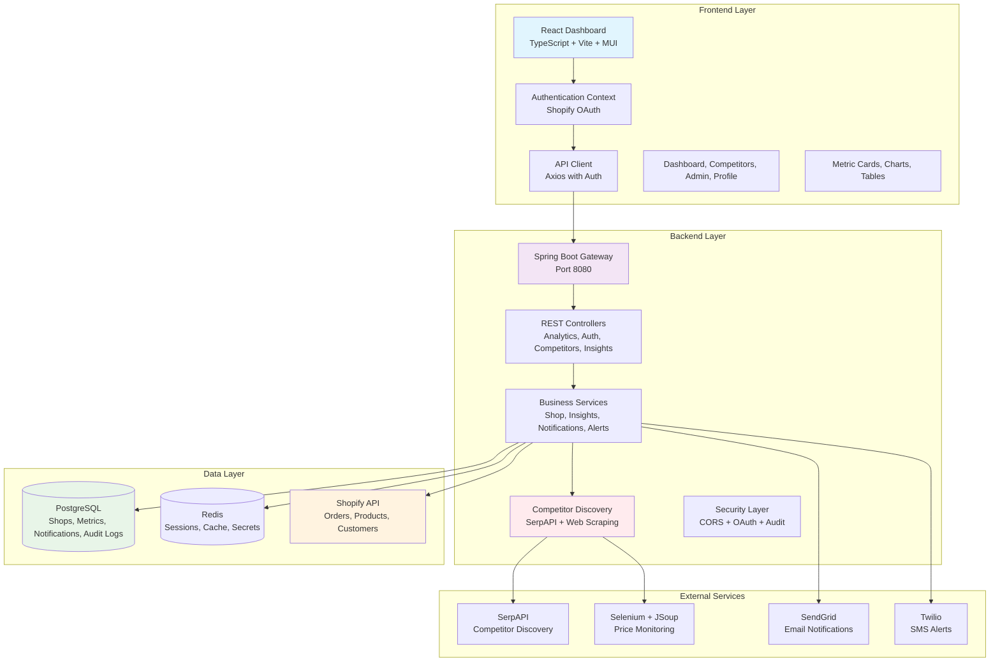
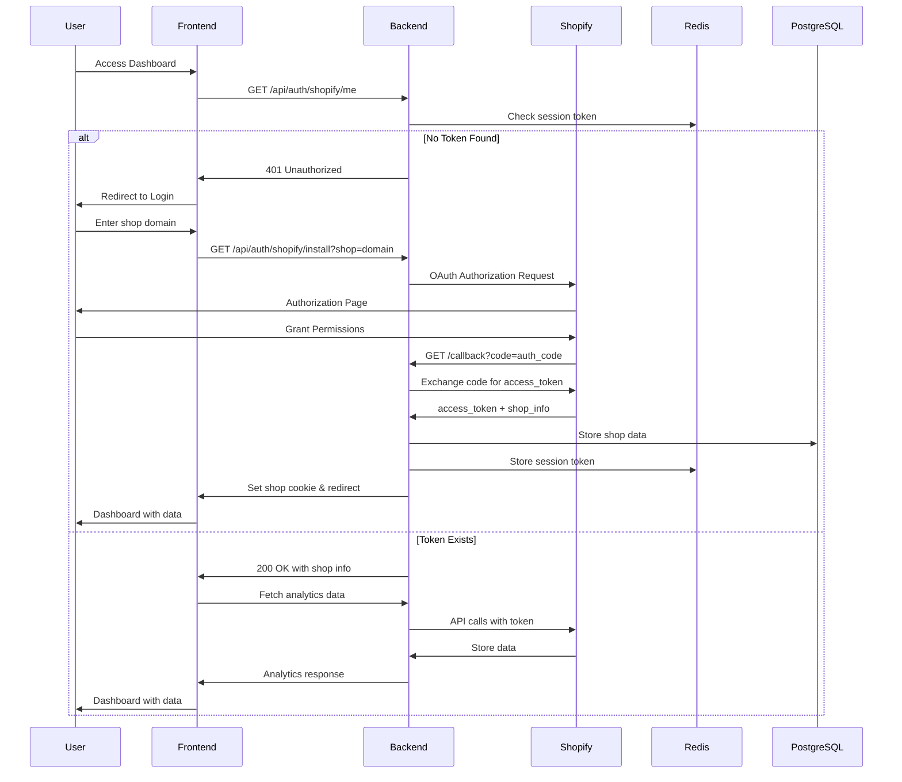
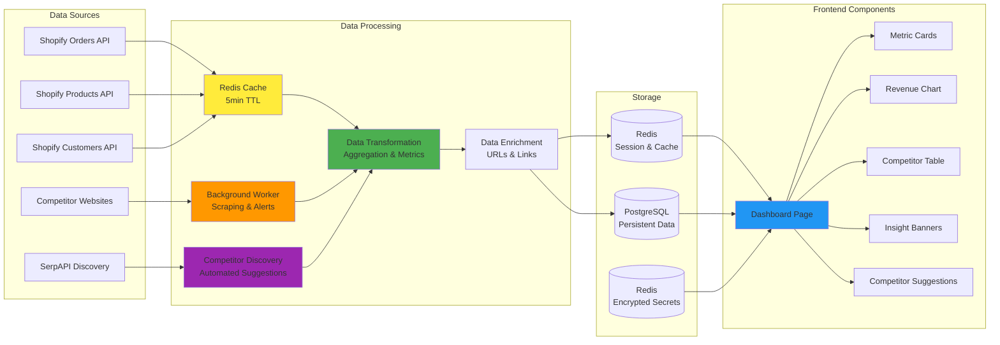

# StoreSight - Advanced Shopify Analytics & Competitor Intelligence Platform

[](https://opensource.org/licenses/Apache-2.0)
[](https://openjdk.java.net/projects/jdk/17/)
[](https://spring.io/projects/spring-boot)
[](https://reactjs.org/)
[](https://www.typescriptlang.org/)
[](https://www.postgresql.org/)
[](https://redis.io/)

StoreSight is a comprehensive, enterprise-grade analytics and competitor intelligence platform designed specifically for Shopify merchants. It provides real-time business insights, automated competitor discovery, and advanced data privacy compliance features.

## 🚀 Key Features

### 📊 **Advanced Analytics Dashboard**
- **Real-time Revenue Tracking**: Live sales data with trend analysis and forecasting
- **Conversion Rate Optimization**: Detailed conversion funnel analysis with industry benchmarks
- **Inventory Intelligence**: Low stock alerts, product performance metrics, and demand forecasting
- **Abandoned Cart Recovery**: Automated detection and recovery strategies for abandoned carts
- **Customer Behavior Analytics**: Anonymous customer journey mapping and segmentation

### 🎯 **Competitor Intelligence**
- **Automated Competitor Discovery**: AI-powered competitor identification using SerpAPI integration
- **Price Monitoring**: Real-time price tracking across competitor websites
- **Market Position Analysis**: Competitive landscape insights and positioning strategies
- **Suggestion Management**: Curated competitor suggestions with approval workflow
- **Web Scraping**: Automated data collection from competitor sites using Selenium

### 🔒 **Enterprise Security & Compliance**
- **GDPR/CCPA Compliance**: Full data privacy compliance with automatic data retention policies
- **Shopify Protected Data**: Compliant with Shopify's Protected Customer Data requirements
- **Audit Logging**: Complete audit trail with 365-day retention for compliance monitoring
- **Encryption**: AES-256 encryption at rest, TLS 1.3 in transit
- **Data Minimization**: Only essential data processed for analytics

### 🔧 **Developer Experience**
- **Modern Tech Stack**: Spring Boot 3.2.3, React 18, TypeScript, PostgreSQL, Redis
- **Comprehensive Testing**: Unit tests, integration tests, and end-to-end testing
- **CI/CD Ready**: Docker containerization and Render deployment configuration
- **API-First Design**: RESTful APIs with comprehensive documentation
- **Real-time Updates**: WebSocket support for live dashboard updates

## 🏗️ Architecture Overview

### System Architecture



## 🔄 Authentication & Security Flow

### Shopify OAuth Integration



## 📊 Data Flow Architecture

### Real-time Analytics Pipeline



## 🔌 API Architecture

### Core Endpoints

| Endpoint                           | Method          | Purpose                             | Authentication |
|------------------------------------|-----------------|-------------------------------------|----------------|
| `/api/auth/shopify/install`        | GET             | Initiate OAuth flow                 | None           |
| `/api/auth/shopify/callback`       | GET             | Handle OAuth callback               | None           |
| `/api/auth/shopify/reauth`         | GET             | Re-authenticate with updated scopes | Cookie         |
| `/api/auth/me`                     | GET             | Get current shop info               | Cookie         |
| `/api/analytics/orders/timeseries` | GET             | Orders data with pagination         | Cookie         |
| `/api/analytics/revenue`           | GET             | Revenue metrics                     | Cookie         |
| `/api/analytics/abandoned-carts`   | GET             | Abandoned cart analytics            | Cookie         |
| `/api/analytics/conversion-rate`   | GET             | Conversion rate metrics             | Cookie         |
| `/api/analytics/inventory/low`     | GET             | Low inventory items                 | Cookie         |
| `/api/analytics/new_products`      | GET             | Recently added products             | Cookie         |
| `/api/analytics/permissions/check` | GET             | Check API permissions               | Cookie         |
| `/api/analytics/audit-logs`        | GET             | View audit logs for compliance      | Cookie         |
| `/api/competitors`                 | GET/POST/DELETE | Competitor management               | Cookie         |
| `/api/competitors/suggestions`     | GET/POST/DELETE | Competitor discovery suggestions    | Cookie         |
| `/api/insights`                    | GET             | Dashboard insights                  | Cookie         |
| `/api/admin/debug`                 | GET             | Debug API access issues             | Cookie         |
| `/api/admin/secrets`               | GET/POST/DELETE | Manage encrypted secrets            | Cookie         |
| `/api/admin/integrations/status`   | GET             | Check integration status            | Cookie         |
| `/api/admin/integrations/test`     | POST            | Test email/SMS integrations         | Cookie         |

### Error Handling & Permission Management

- 🔍 **Comprehensive Error Codes** - Detailed error responses with resolution guidance
- 📊 **Permission Validation** - Real-time API access validation and scope checking
- 🔄 **Automatic Retry Logic** - Intelligent retry with exponential backoff
- 📝 **Audit Trail** - Complete PostgreSQL-based audit logging with 365-day retention
- 🛡️ **Privacy Compliance** - GDPR/CCPA compliant data processing and retention
- 🔧 **Debug Endpoints** - Built-in troubleshooting tools for API access issues

## 🗄️ Database Schema

### Core Tables

```sql
-- Shops table for store management
CREATE TABLE shops (
    id SERIAL PRIMARY KEY,
    shopify_domain VARCHAR(255) NOT NULL UNIQUE,
    access_token VARCHAR(255) NOT NULL,
    created_at TIMESTAMP DEFAULT CURRENT_TIMESTAMP
);

-- Products table for inventory tracking
CREATE TABLE products (
    id SERIAL PRIMARY KEY,
    shop_id INTEGER REFERENCES shops(id),
    shopify_product_id VARCHAR(64) NOT NULL,
    title VARCHAR(255),
    price NUMERIC(12,2),
    created_at TIMESTAMP DEFAULT CURRENT_TIMESTAMP
);

-- Orders table for sales analytics
CREATE TABLE orders (
    id SERIAL PRIMARY KEY,
    shop_id INTEGER REFERENCES shops(id),
    shopify_order_id VARCHAR(64) NOT NULL,
    total_price NUMERIC(12,2),
    created_at TIMESTAMP DEFAULT CURRENT_TIMESTAMP
);

-- Competitor suggestions for discovery
CREATE TABLE competitor_suggestions (
    id BIGSERIAL PRIMARY KEY,
    shop_id BIGINT NOT NULL REFERENCES shops(id) ON DELETE CASCADE,
    product_id BIGINT NOT NULL REFERENCES products(id) ON DELETE CASCADE,
    suggested_url TEXT NOT NULL,
    title VARCHAR(255),
    price NUMERIC(12,2),
    source VARCHAR(50) NOT NULL DEFAULT 'GOOGLE_SHOPPING',
    discovered_at TIMESTAMP WITH TIME ZONE DEFAULT CURRENT_TIMESTAMP,
    status VARCHAR(20) NOT NULL DEFAULT 'NEW',
    UNIQUE(shop_id, product_id, suggested_url)
);

-- Audit logs for compliance
CREATE TABLE audit_logs (
    id BIGSERIAL PRIMARY KEY,
    shop_id BIGINT REFERENCES shops(id),
    action VARCHAR(100) NOT NULL,
    details TEXT,
    user_agent VARCHAR(500),
    ip_address VARCHAR(255),
    created_at TIMESTAMP DEFAULT CURRENT_TIMESTAMP
);
```

## 🚀 Quick Start

### Prerequisites

- **Java 17** or higher
- **Node.js 18** or higher
- **PostgreSQL 15** or higher
- **Redis 7** or higher
- **Shopify Partner Account** with app credentials

### Local Development Setup

1. **Clone the repository**
   ```bash
   git clone https://github.com/your-username/storesight.git
   cd storesight
   ```

2. **Set up environment variables**
   ```bash
   cp .env.example .env
   # Edit .env with your actual values
   ```

3. **Start PostgreSQL and Redis**
   ```bash
   # Using Docker
   docker run -d --name postgres -e POSTGRES_PASSWORD=storesight -p 5432:5432 postgres:15
   docker run -d --name redis -p 6379:6379 redis:7
   ```

4. **Run database migrations**
   ```bash
   cd backend
   ./gradlew flywayMigrate
   ```

5. **Start the backend**
   ```bash
   cd backend
   ./gradlew bootRun
   ```

6. **Start the frontend**
   ```bash
   cd frontend
   npm install
   npm run dev
   ```

7. **Access the application**
   - Frontend: http://localhost:5173
   - Backend API: http://localhost:8080

### Environment Variables

Required environment variables (see `ENVIRONMENT_SETUP.md` for details):

```bash
# Database
DB_URL=jdbc:postgresql://localhost:5432/storesight
DB_USER=storesight
DB_PASS=storesight

# Redis
REDIS_HOST=localhost
REDIS_PORT=6379

# Shopify (Required)
SHOPIFY_API_KEY=your_shopify_api_key
SHOPIFY_API_SECRET=your_shopify_api_secret
SHOPIFY_REDIRECT_URI=http://localhost:8080/api/auth/shopify/callback

# Optional Services
SERPAPI_KEY=your_serpapi_key
SENDGRID_API_KEY=your_sendgrid_key
TWILIO_ACCOUNT_SID=your_twilio_sid
TWILIO_AUTH_TOKEN=your_twilio_token
```

## 🧪 Testing

### Backend Testing
```bash
cd backend
./gradlew test
```

### Frontend Testing
```bash
cd frontend
npm run test
```

### Integration Testing
```bash
# Run with test containers
./gradlew integrationTest
```

## 🚀 Deployment

### Docker Deployment

1. **Build the application**
   ```bash
   docker-compose build
   ```

2. **Deploy with Docker Compose**
   ```bash
   docker-compose up -d
   ```

### Render Deployment

The application includes a `render.yaml` configuration for easy deployment to Render:

```yaml
services:
  - type: web
    name: storesight-backend
    env: docker
    plan: standard
    dockerfilePath: backend/Dockerfile
    
  - type: worker
    name: storesight-worker
    env: docker
    plan: standard
    dockerfilePath: backend/Dockerfile
    startCommand: "java -jar app.jar --spring.profiles.active=worker"
    
  - type: static
    name: storesight-frontend
    env: static
    buildCommand: "cd frontend && npm install && npm run build"
    staticPublishPath: frontend/dist
```

## 🔒 Security & Compliance

### Data Privacy Features

- ✅ **GDPR/CCPA Compliance** - Full data privacy compliance
- ✅ **Shopify Protected Data** - Compliant with Shopify requirements
- ✅ **Data Minimization** - Only essential data processed
- ✅ **Automatic Retention** - 60-day data retention with auto-deletion
- ✅ **Audit Logging** - Complete audit trail for compliance
- ✅ **Encryption** - AES-256 at rest, TLS 1.3 in transit

### Security Measures

- 🔐 **OAuth 2.0 Authentication** - Secure Shopify integration
- 🛡️ **CORS Protection** - Cross-origin request security
- 🔍 **Input Validation** - Comprehensive input sanitization
- 📝 **Audit Logging** - All actions logged for security monitoring
- 🔄 **Session Management** - Secure session handling with Redis

## 🤝 Contributing

We welcome contributions! Please see our [Contributing Guidelines](CONTRIBUTING.md) for details on:

- Code style and conventions
- Testing requirements
- Pull request process
- Issue reporting

### Development Workflow

1. Fork the repository
2. Create a feature branch
3. Make your changes
4. Add tests
5. Submit a pull request

## 📚 Documentation

- [Environment Setup](ENVIRONMENT_SETUP.md) - Detailed setup instructions
- [Contributing Guidelines](CONTRIBUTING.md) - How to contribute
- [Privacy Policy](PRIVACY_POLICY.md) - Data handling and privacy
- [API Documentation](docs/api.md) - Complete API reference

## 🏗️ Technology Stack

### Backend
- **Framework**: Spring Boot 3.2.3
- **Language**: Java 17
- **Database**: PostgreSQL 15
- **Cache**: Redis 7
- **Build Tool**: Gradle
- **Testing**: JUnit 5, TestContainers

### Frontend
- **Framework**: React 18
- **Language**: TypeScript 5.5.4
- **Build Tool**: Vite
- **UI Library**: Material-UI (MUI)
- **Charts**: Recharts
- **Styling**: Tailwind CSS

### External Services
- **Shopify API**: OAuth integration and data access
- **SerpAPI**: Competitor discovery
- **SendGrid**: Email notifications
- **Twilio**: SMS alerts
- **Selenium**: Web scraping for competitor data

## 📄 License

This project is licensed under the Apache License 2.0 - see the [LICENSE](LICENSE) file for details.

## 🆘 Support

- **Documentation**: Check the docs folder for detailed guides
- **Issues**: Report bugs and feature requests via GitHub Issues
- **Discussions**: Use GitHub Discussions for questions and ideas
- **Email**: support@storesight.com

## 🗺️ Roadmap

### Upcoming Features
- [ ] **Advanced AI Insights** - Machine learning-powered business recommendations
- [ ] **Multi-store Management** - Support for multiple Shopify stores
- [ ] **Real-time Notifications** - WebSocket-based live updates
- [ ] **Advanced Reporting** - Custom report builder and scheduling
- [ ] **Mobile App** - React Native mobile application
- [ ] **API Rate Limiting** - Advanced rate limiting and throttling
- [ ] **Data Export** - CSV/Excel export functionality
- [ ] **Webhook Integration** - Real-time Shopify webhook processing

### Performance Improvements
- [ ] **Caching Optimization** - Advanced Redis caching strategies
- [ ] **Database Optimization** - Query optimization and indexing
- [ ] **CDN Integration** - Global content delivery network
- [ ] **Load Balancing** - Horizontal scaling support

---

**StoreSight** - Empowering Shopify merchants with intelligent analytics and competitor insights. 🚀