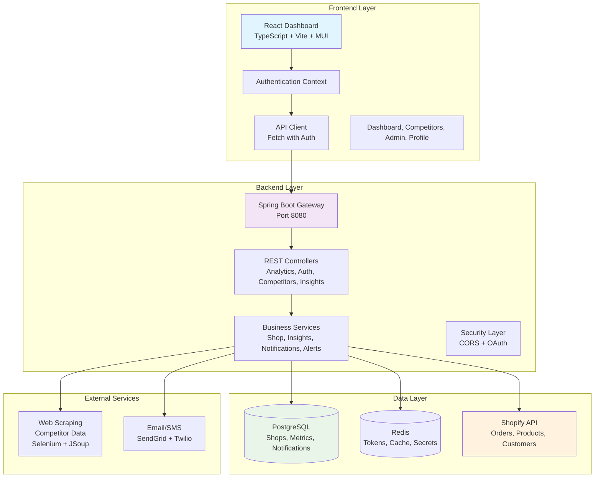
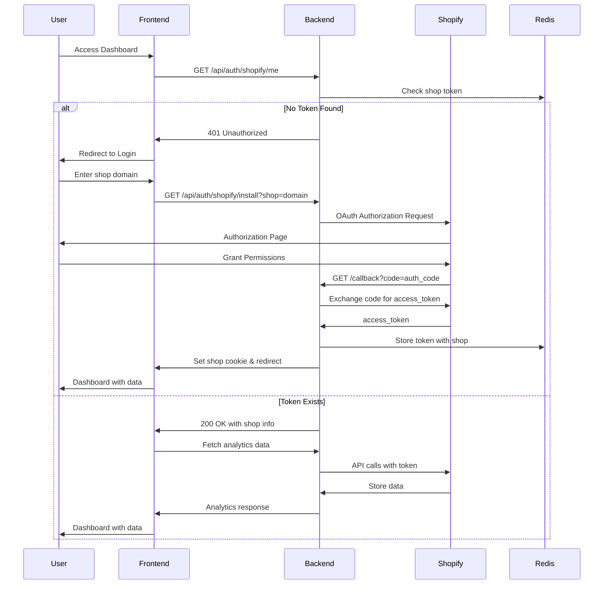
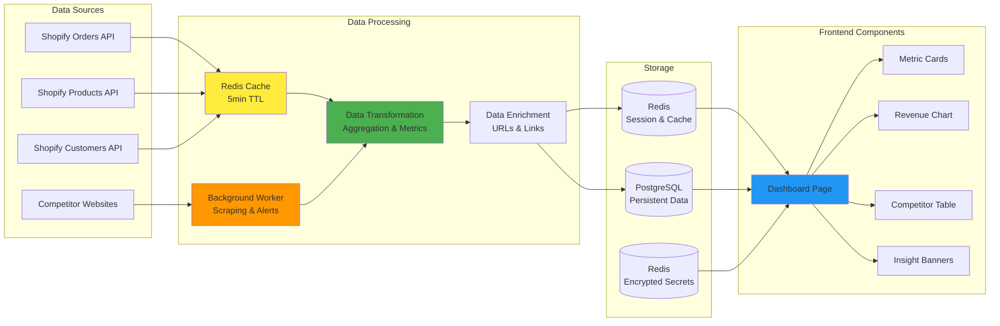
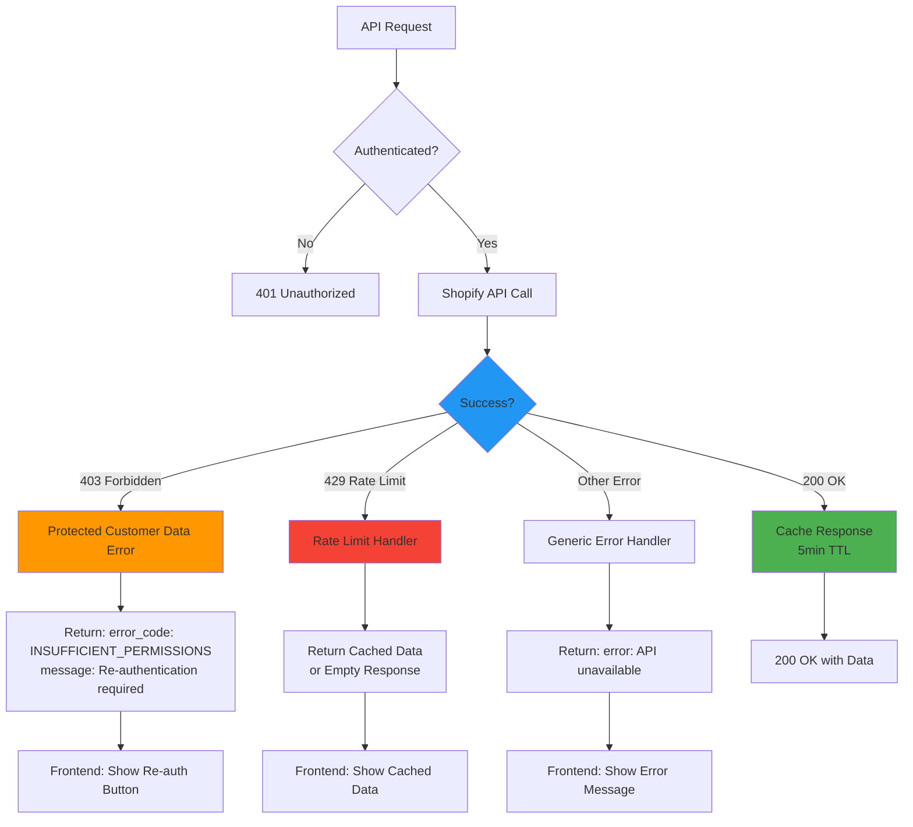

# StoreSight - Shopify Analytics Dashboard

StoreSight is a modern, real-time analytics dashboard for Shopify stores that provides comprehensive insights into
revenue, orders, abandoned carts, conversion rates, inventory management, and competitor tracking with seamless Shopify
integration.

## 🏗️ Architecture Overview

### System Architecture



## 🔄 Authentication Flow

### Shopify OAuth Integration



## 📊 Data Flow Architecture

### Real-time Analytics Pipeline



## 🔌 API Architecture

### Core Endpoints

| Endpoint                           | Method          | Purpose                             | Authentication |
|------------------------------------|-----------------|-------------------------------------|----------------|
| `/api/auth/shopify/install`        | GET             | Initiate OAuth flow                 | None           |
| `/api/auth/shopify/callback`       | GET             | Handle OAuth callback               | None           |
| `/api/auth/shopify/reauth`         | GET             | Re-authenticate with updated scopes | Cookie         |
| `/api/auth/me`                     | GET             | Get current shop info               | Cookie         |
| `/api/analytics/orders/timeseries` | GET             | Orders data with pagination         | Cookie         |
| `/api/analytics/revenue`           | GET             | Revenue metrics                     | Cookie         |
| `/api/analytics/abandoned-carts`   | GET             | Abandoned cart analytics            | Cookie         |
| `/api/analytics/conversion-rate`   | GET             | Conversion rate metrics             | Cookie         |
| `/api/analytics/inventory/low`     | GET             | Low inventory items                 | Cookie         |
| `/api/analytics/new_products`      | GET             | Recently added products             | Cookie         |
| `/api/analytics/permissions/check` | GET             | Check API permissions               | Cookie         |
| `/api/competitors`                 | GET/POST/DELETE | Competitor management               | Cookie         |
| `/api/insights`                    | GET             | Dashboard insights                  | Cookie         |
| `/api/admin/debug`                 | GET             | Debug API access issues             | Cookie         |
| `/api/admin/secrets`               | GET/POST/DELETE | Manage encrypted secrets            | Cookie         |

### Error Handling & Permission Management



## 🛠️ Technology Stack

### Frontend

- **Framework**: React 18 with TypeScript
- **UI Library**: Material-UI (MUI) v7 with custom theme
- **Additional UI**: Tailwind CSS for utility classes
- **Routing**: React Router v6
- **Charts**: Recharts for data visualization
- **HTTP Client**: Fetch API with authentication wrapper
- **Build Tool**: Vite
- **Development**: Hot reload, TypeScript checking

### Backend

- **Framework**: Spring Boot 3.2.3
- **Language**: Java 17+
- **Web**: Spring Web MVC + WebFlux (Hybrid)
- **Security**: Spring Security with OAuth2
- **Database**: Spring Data JPA with PostgreSQL
- **Caching**: Spring Data Redis (Reactive + Traditional)
- **Migrations**: Flyway
- **Build Tool**: Gradle
- **Web Scraping**: Selenium WebDriver + JSoup
- **Background Processing**: Spring Scheduling

### Infrastructure

- **Database**: PostgreSQL 14+
- **Cache**: Redis 6+ (sessions, cache, encrypted secrets)
- **Deployment**: Render.com (via render.yaml)
- **Monitoring**: Spring Actuator
- **Logging**: SLF4J with Logback

## ✨ Features

### Core Analytics

- 📈 **Real-time Revenue Tracking** - Live revenue metrics and trends with historical data
- 📦 **Order Analytics** - Order volume, trends, and customer insights with timeseries data
- 🛒 **Abandoned Cart Analysis** - Track and analyze abandoned cart rates and recovery opportunities
- 📊 **Conversion Rate Monitoring** - Real-time conversion rate tracking with industry benchmarks
- 🛍️ **Product Performance** - Top products, sales metrics, inventory levels
- 📊 **Interactive Dashboards** - Responsive charts and visualizations with real-time updates
- 🔄 **Automatic Data Sync** - Real-time synchronization with Shopify APIs

### Advanced Features

- 🏪 **Competitor Tracking** - Monitor competitor prices and products with web scraping
- 📧 **Automated Alerts** - Email/SMS notifications for key events and threshold breaches
- 📋 **Custom Reports** - Scheduled reports and data exports
- 🔍 **Low Inventory Alerts** - Proactive inventory management with automated notifications
- 📱 **Mobile Responsive** - Full mobile and tablet support with responsive design
- 🔐 **Privacy Compliance** - Built-in privacy controls and data protection features
- 🔧 **Secret Management** - Encrypted secret storage in Redis with admin interface

### Integration Features

- 🔐 **Shopify OAuth** - Secure authentication with proper scopes and token management
- 🔄 **Permission Management** - Graceful handling of API limitations and Protected Customer Data restrictions
- 💾 **Smart Caching** - Redis caching for improved performance and reduced API calls
- 🛡️ **Error Handling** - Comprehensive error recovery and user-friendly error messages
- 🔗 **Deep Links** - Direct links to Shopify admin pages for seamless navigation
- 🔍 **Debug Tools** - Built-in debugging endpoints for troubleshooting API access issues

## 🚀 Quick Start

### Prerequisites

- **Java 17+** (for backend)
- **Node.js 18+** (for frontend)
- **PostgreSQL 14+** (for database)
- **Redis 6+** (for caching)
- **Shopify Partner Account** (for API credentials)

### 1. Clone Repository

```bash
git clone https://github.com/your-org/storesight.git
cd storesight
```

### 2. Backend Setup

```bash
cd backend

# Configure application properties
# Edit src/main/resources/application.properties with your settings:
# - Database connection
# - Redis connection  
# - Shopify API credentials
# - External service keys

# Build and run
./gradlew bootRun
```

### 3. Frontend Setup

```bash
cd frontend

# Install dependencies
npm install

# Start development server (no .env file needed for local development)
npm run dev
```

### 4. Database Setup

```bash
# Create database
createdb storesight

# Run migrations (handled automatically by Flyway)
# Migrations are in: backend/src/main/resources/db/migration/
```

## 📝 Configuration

### Backend Configuration (`application.properties`)

```properties
# Database
spring.datasource.url=jdbc:postgresql://localhost:5432/storesight
spring.datasource.username=storesight
spring.datasource.password=storesight
# Redis
spring.data.redis.host=localhost
spring.data.redis.port=6379

# Shopify API
shopify.api.key=${SHOPIFY_API_KEY:}
shopify.api.secret=${SHOPIFY_API_SECRET:}
shopify.scopes=read_products,read_orders,read_customers,read_inventory
shopify.redirect_uri=${SHOPIFY_REDIRECT_URI:http://localhost:8080/api/auth/shopify/callback}
# Frontend URL
frontend.url=${FRONTEND_URL:http://localhost:5173}
# External Services (dummy values for development)
sendgrid.api-key=dummy_sendgrid_key
twilio.account_sid=dummy_twilio_sid
twilio.auth_token=dummy_twilio_token
twilio.from_number=${TWILIO_FROM_NUMBER:+1234567890}
# Server
server.port=${SERVER_PORT:8080}
```

### Frontend Configuration

No environment file needed for local development. The frontend automatically connects to `http://localhost:8080` for the
backend API.

## 🔧 Development

### Running in Development Mode

```bash
# Terminal 1: Backend
cd backend && ./gradlew bootRun

# Terminal 2: Frontend  
cd frontend && npm run dev

# Terminal 3: Database (if using Docker)
docker run --name storesight-postgres -e POSTGRES_DB=storesight -e POSTGRES_USER=storesight -e POSTGRES_PASSWORD=storesight -p 5432:5432 -d postgres:14

# Terminal 4: Redis (if using Docker)
docker run --name storesight-redis -p 6379:6379 -d redis:6
```

### Building for Production

```bash
# Backend
cd backend
./gradlew build
java -jar build/libs/storesight-backend-*.jar

# Frontend
cd frontend
npm run build
# Serve the dist/ directory with your web server
```

## 📚 API Documentation

### Shopify Integration

The application integrates with Shopify using OAuth 2.0 and requires the following scopes:

- `read_products` - Access product catalog and inventory
- `read_orders` - Access order history and analytics
- `read_customers` - Access customer data and insights
- `read_inventory` - Access inventory levels and alerts

### Protected Customer Data

⚠️ **Important**: The app requires special approval from Shopify for Protected Customer Data access. This includes:

- Order details and customer information
- Revenue analytics and financial data
- Customer behavior insights

To enable full functionality:

1. Contact Shopify Partner Support
2. Request Protected Customer Data access
3. Re-authenticate your app after approval

### Rate Limiting

- Shopify API: 40 requests per app per store per minute
- Application implements intelligent caching and request batching
- Graceful degradation when rate limits are exceeded

### Error Codes

| Code                        | Description                         | Resolution                                     |
|-----------------------------|-------------------------------------|------------------------------------------------|
| `INSUFFICIENT_PERMISSIONS`  | Missing Shopify API scopes          | Re-authenticate via `/api/auth/shopify/reauth` |
| `PROTECTED_DATA_RESTRICTED` | Protected Customer Data restriction | Contact Shopify for app approval               |
| `RATE_LIMITED`              | Shopify API rate limit exceeded     | Wait and retry, cached data served             |
| `SHOPIFY_UNAVAILABLE`       | Shopify API temporarily unavailable | Cached data served, retry automatically        |

## 🚢 Deployment

### Render.com Deployment

The application is configured for deployment on Render.com using the `render.yaml` configuration:

```bash
# Deploy to Render.com
# 1. Connect your GitHub repository to Render
# 2. The render.yaml file will automatically configure:
#    - Web service (backend)
#    - Worker service (background tasks)
#    - Static site (frontend)
# 3. Set environment variables in Render dashboard
```

### Production Checklist

- [ ] Configure production database
- [ ] Set up Redis cluster
- [ ] Configure HTTPS/SSL
- [ ] Set production Shopify app credentials
- [ ] Configure monitoring and logging
- [ ] Set up backup procedures
- [ ] Configure load balancing (if needed)
- [ ] Request Protected Customer Data access from Shopify
- [ ] Set up secret encryption key (`SECRETS_ENCRYPTION_KEY`)

## 🧪 Testing

### Backend Tests

```bash
cd backend
./gradlew test
```

### Frontend Tests

```bash
cd frontend
npm test
```

### Integration Tests

```bash
cd backend
./gradlew integrationTest
```

## 🤝 Contributing

1. Fork the repository
2. Create your feature branch (`git checkout -b feature/amazing-feature`)
3. Commit your changes (`git commit -m 'Add some amazing feature'`)
4. Push to the branch (`git push origin feature/amazing-feature`)
5. Open a Pull Request

### Development Guidelines

- Follow existing code style and conventions
- Add tests for new features
- Update documentation for API changes
- Ensure all tests pass before submitting PR

## 🆘 Support & Troubleshooting

### Common Issues

**403 Forbidden Errors (Protected Customer Data)**

- Cause: Shopify Protected Customer Data restrictions
- Solution: Contact Shopify Partner Support for app approval, then re-authenticate

**Empty Dashboard Data**

- Cause: New store with no orders/products or API permission issues
- Solution: Add products and test orders in Shopify, check API permissions

**Connection Errors**

- Cause: Database or Redis connection issues
- Solution: Check connection strings and service status

**OAuth Authentication Issues**

- Cause: Incorrect app credentials or redirect URIs
- Solution: Verify Shopify app settings and environment variables

**Secret Management Issues**

- Cause: Missing or invalid encryption key
- Solution: Set `SECRETS_ENCRYPTION_KEY` environment variable (16+ characters)

### Getting Help

- 📧 Email: support@storesight.com
- 💬 GitHub Issues: [Create an issue](https://github.com/your-org/storesight/issues)
- 📖 Documentation: [Full docs](https://docs.storesight.com)

## 📄 License

This project is licensed under the Apache 2.0 License - see the [LICENSE](LICENSE) file for details.

---

**Built with ❤️ for Shopify merchants who want better insights into their business.**