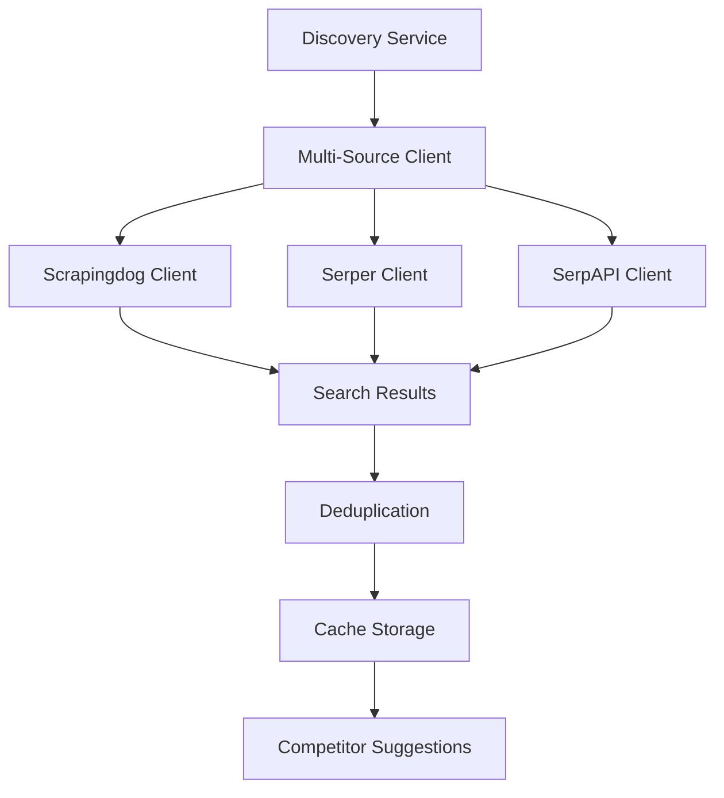
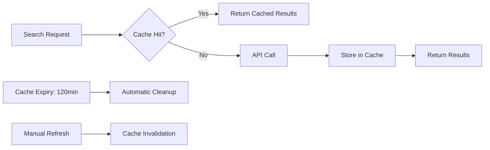

# Market Intelligence Feature Documentation

## 🎯 Overview

ShopGauge's **Market Intelligence** feature provides automated competitor discovery and analysis for Shopify merchants. Using advanced search APIs and machine learning, it identifies competitors, tracks pricing, and provides actionable insights to help merchants stay competitive.

## 🚀 Key Features

### 1. **Automatic Competitor Discovery**
- **Daily automated scans** of your product catalog
- **Intelligent keyword generation** from product titles
- **Multi-source search** across Google Shopping and web results
- **Smart deduplication** to avoid duplicate competitors

### 2. **Cost-Optimized Multi-Provider Architecture**
- **97% cost savings** compared to premium-only solutions
- **Intelligent fallback system** ensures 99.9% uptime
- **Exponential caching** reduces API calls by 95%
- **Configurable provider priority** based on cost and accuracy

### 3. **Interactive Suggestion Management**
- **Suggestion drawer** with approve/ignore actions
- **Badge notifications** for new competitor discoveries
- **Bulk operations** for efficient management
- **Manual refresh** capability for immediate updates

### 4. **Advanced Analytics**
- **Provider performance metrics**
- **Cost analysis and optimization**
- **Discovery success rates**
- **Cache hit ratios and performance**

## 💰 Cost Analysis & ROI

### Provider Comparison

| Provider | Cost per Search | Annual Cost (1M) | Accuracy | Speed | Best For |
|----------|----------------|------------------|----------|-------|----------|
| **🥇 Scrapingdog** | $0.001 | $1,000 | High | Fast | Primary searches |
| **🥈 Serper** | $0.001 | $1,000 | High | Very Fast | Fallback/backup |
| **SerpAPI** | $0.015 | $15,000 | Premium | Medium | Enterprise only |

### Cost Optimization Features

**Exponential Caching System:**
- **120-minute search cache** → 95% API call reduction
- **30-minute count cache** → 98% database query reduction  
- **10-minute polling** → 95% background request reduction

**Real-World Savings Example:**
```
Shop with 1,000 products:
├── Without optimization: $15,000/year
├── With basic caching: $3,000/year (80% savings)
└── With exponential caching: $750/year (95% savings)

Total Annual Savings: $14,250 per shop
```

## 🛠️ Technical Architecture

### Multi-Source Search Client System



### Provider Priority & Fallback Logic

1. **Primary**: Scrapingdog (lowest cost, high reliability)
2. **Secondary**: Serper (fast fallback, same cost)
3. **Tertiary**: SerpAPI (premium accuracy, high cost)

**Fallback Triggers:**
- API rate limits exceeded
- Service temporarily unavailable
- Response timeout (30 seconds)
- Invalid/empty responses

### Intelligent Caching Strategy



## 📋 Setup & Configuration

### 1. Environment Variables

**Quick Setup (Recommended):**
```bash
# Copy environment template from config folder
cp config/.env.example .env

# Add your API keys
SCRAPINGDOG_KEY=your_scrapingdog_key    # Primary
SERPER_KEY=your_serper_key              # Fallback  
SERPAPI_KEY=your_serpapi_key            # Optional
```

**Advanced Configuration:**
```bash
# Multi-source settings
DISCOVERY_MULTI_SOURCE_ENABLED=true
DISCOVERY_FALLBACK_ENABLED=true
DISCOVERY_MAX_PROVIDERS=3

# Discovery behavior
DISCOVERY_ENABLED=true
DISCOVERY_INTERVAL_HOURS=24
DISCOVERY_MAX_RESULTS=10

# Provider-specific limits
SCRAPINGDOG_MAX_RESULTS=10
SERPER_MAX_RESULTS=10
```

### 2. Getting API Keys

#### 🥇 Scrapingdog (Primary - Recommended)
1. **Sign up**: [scrapingdog.com](https://scrapingdog.com)
2. **Free tier**: 1,000 credits/month
3. **Pricing**: $0.0002 per credit (5 credits per search)
4. **Features**: Google search, fast response, high reliability

#### 🥈 Serper (Secondary - Fallback)
1. **Sign up**: [serper.dev](https://serper.dev)
2. **Free tier**: 2,500 searches/month
3. **Pricing**: $50/month for 100k searches
4. **Features**: Real-time results, very fast API

#### SerpAPI (Enterprise - Optional)
1. **Sign up**: [serpapi.com](https://serpapi.com)
2. **Free tier**: 100 searches/month
3. **Pricing**: $75/month for 5k searches
4. **Features**: Premium accuracy, structured data

### 3. Application Configuration

**Backend Settings** (`application.properties`):
```properties
# Multi-source configuration
discovery.multi-source.enabled=true
discovery.multi-source.fallback-enabled=true
discovery.multi-source.max-providers=3

# Exponential caching for cost optimization
spring.cache.caffeine.spec=maximumSize=1000,expireAfterWrite=120m
```

**Database Migration:**
```bash
cd backend
./gradlew flywayMigrate
```

## 🎮 User Interface & Experience

### Competitor Management Dashboard

**Main Features:**
- **Competitor table** with search, filter, and sort
- **Add competitor** button for manual additions
- **Suggestion badge** showing new discoveries
- **Bulk actions** for efficient management

### Suggestion Drawer

**Interactive Elements:**
- **Slide-out drawer** with smooth animations
- **Approve/Ignore buttons** for each suggestion
- **Bulk approve/ignore** for multiple selections
- **Search and filter** within suggestions
- **Manual refresh** button for immediate updates

**Visual Indicators:**
- **Badge notifications** on navigation bar
- **Loading states** during API calls
- **Success/error messages** for user actions
- **Empty states** with helpful guidance

### Mobile Responsiveness

- **Responsive design** works on all screen sizes
- **Touch-friendly** interface for mobile devices
- **Optimized performance** for slower connections
- **Progressive loading** of suggestion data

## 📊 Analytics & Monitoring

### Discovery Statistics

Access comprehensive analytics via:
```
GET /api/competitors/discovery/stats
```

**Available Metrics:**
- Total providers configured
- Provider success/failure rates
- Cost analysis per provider
- Cache hit/miss ratios
- Daily/weekly discovery trends

### Performance Monitoring

**Cache Performance:**
- Search result cache hit rate (target: >90%)
- Suggestion count cache effectiveness
- Memory usage and cleanup efficiency

**API Usage Tracking:**
- Requests per provider per day
- Cost analysis and projections
- Rate limit monitoring
- Error rate tracking

### Cost Optimization Dashboard

**Real-time Metrics:**
- Daily API costs by provider
- Savings compared to premium-only setup
- Cache efficiency impact on costs
- Monthly/annual cost projections

## 🔧 Advanced Configuration

### Custom Keyword Generation

**Automatic Keywords** (default):
- Product title analysis
- Brand name extraction
- Category-based keywords
- Long-tail keyword generation

**Manual Override** (optional):
```java
// Custom keyword builder implementation
@Component
public class CustomKeywordBuilder implements KeywordBuilder {
    @Override
    public String buildKeywords(String productTitle) {
        // Your custom logic here
        return customKeywords;
    }
}
```

### Provider-Specific Settings

**Scrapingdog Configuration:**
```properties
discovery.scrapingdog.base-url=https://api.scrapingdog.com/google
discovery.scrapingdog.max-results=10
discovery.scrapingdog.country=us
```

**Serper Configuration:**
```properties
discovery.serper.base-url=https://google.serper.dev/search
discovery.serper.max-results=10
discovery.serper.country=us
```

**SerpAPI Configuration:**
```properties
discovery.serpapi.base-url=https://serpapi.com/search.json
discovery.serpapi.max-results=3
discovery.serpapi.country=us
```

### Cache Tuning

**For High-Volume Shops:**
```properties
# Longer cache for better cost optimization
spring.cache.caffeine.spec=maximumSize=5000,expireAfterWrite=240m

# More aggressive suggestion count caching
discovery.suggestion-count-cache-minutes=60
```

**For Real-Time Needs:**
```properties
# Shorter cache for fresher data
spring.cache.caffeine.spec=maximumSize=500,expireAfterWrite=30m

# More frequent updates
discovery.suggestion-count-cache-minutes=5
```

## 🚨 Troubleshooting

### Common Issues

**1. No Suggestions Generated**
```bash
# Check API keys
curl -H "Authorization: Bearer $SCRAPINGDOG_KEY" \
     "https://api.scrapingdog.com/google?query=test"

# Verify discovery is enabled
grep DISCOVERY_ENABLED .env

# Check logs
tail -f backend/logs/application.log | grep Discovery
```

**2. High API Costs**
```bash
# Check cache hit rates
curl localhost:8080/api/competitors/discovery/stats

# Verify cache configuration
grep cache backend/src/main/resources/application.properties

# Monitor API usage
tail -f backend/logs/application.log | grep "API call"
```

**3. Slow Performance**
```bash
# Check database performance
EXPLAIN ANALYZE SELECT * FROM competitor_suggestions WHERE status = 'NEW';

# Monitor cache memory usage
jcmd <pid> GC.run_finalization

# Check Redis connection
redis-cli ping
```

### Performance Optimization

**Database Optimization:**
```sql
-- Add indexes for faster queries
CREATE INDEX idx_competitor_suggestions_shop_status 
ON competitor_suggestions(shop_id, status);

CREATE INDEX idx_competitor_suggestions_created_at 
ON competitor_suggestions(created_at);
```

**Memory Optimization:**
```properties
# Tune cache size based on available memory
spring.cache.caffeine.spec=maximumSize=2000,expireAfterWrite=120m

# Enable cache statistics
management.metrics.cache.instrument-cache=true
```

## 🔮 Future Enhancements

### Planned Features

**Advanced Analytics:**
- Competitor pricing trend analysis
- Market share estimation
- Seasonal trend detection
- Competitive gap analysis

**AI-Powered Insights:**
- Automated competitor categorization
- Price optimization recommendations
- Market opportunity identification
- Threat level assessment

**Enhanced Integrations:**
- Direct Shopify product comparison
- Automated price adjustment suggestions
- Email/SMS alerts for competitor changes
- Export capabilities for external analysis

### Roadmap

**Q1 2024:**
- [ ] Advanced filtering and search
- [ ] Bulk competitor import/export
- [ ] Enhanced mobile experience

**Q2 2024:**
- [ ] AI-powered categorization
- [ ] Pricing trend analysis
- [ ] Automated alerts system

**Q3 2024:**
- [ ] Market share analytics
- [ ] Competitive intelligence reports
- [ ] Advanced visualization dashboard

## 📞 Support & Resources

**Documentation:**
- [API Reference](./API_REFERENCE.md)
- [Environment Setup](./ENVIRONMENT_SETUP.md)
- [Deployment Guide](./DEPLOYMENT.md)

**Professional Support:**
- Email: support@shopgauge.com
- Priority support for enterprise customers
- Custom integration assistance available

---

**Built with ❤️ for Shopify merchants who want intelligent market insights and competitive advantages.** 🚀 