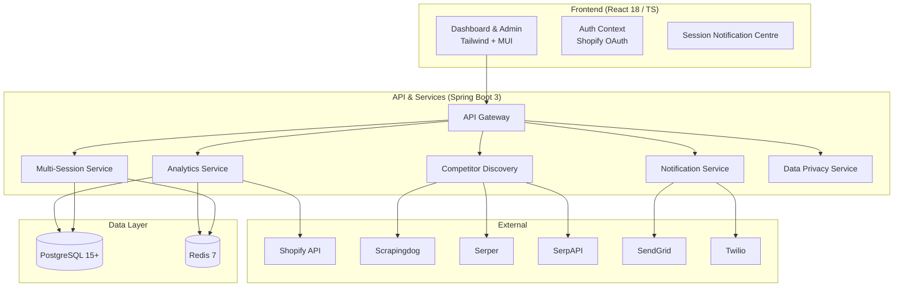

# ShopGauge Documentation Hub

Welcome to the **ShopGauge** documentation hub. This is the single starting point for all technical and product
information about the platform. If you're new to ShopGauge, start here.

> **Audience**: Shopify merchants, solution architects, DevOps / SRE engineers, and developers integrating with or
> contributing to ShopGauge.

---

## 📈 Platform Overview

**ShopGauge** is an enterprise-grade analytics & competitor-intelligence platform for Shopify. Key capabilities include:

| Category | Capabilities |
|----------|--------------|
| **Advanced Analytics** | Real-time revenue, conversion, inventory & customer behaviour dashboards (7+ chart types) |
| **AI-Powered Market Intelligence** | Multi-provider competitor discovery (Scrapingdog, Serper, SerpAPI) with fall-back & cost optimisation |
| **Multi-Session Architecture** | Concurrent log-ins, session isolation, token caching & intelligent clean-up |
| **Notification System** | Session-scoped notifications via Email (SendGrid) & SMS (Twilio) with in-app centre |
| **Security & Compliance** | GDPR / CCPA, Shopify Protected Data L2, AES-256 at rest, TLS 1.3 in transit, full audit trail |
| **Cost & Performance Optimisations** | Exponential caching, debounced refreshes, 95 %+ API cost reduction |
| **Enterprise UX** | Intelligent loading screen, responsive dashboard, mobile navigation & PWA-ready |

---

## 🏗️ Architecture

> For a deep-dive into the **multi-session design**, see **[Multi-Session Architecture](MULTI_SESSION_ARCHITECTURE.md)**.

---

## 📚 Feature-Level Documentation

| Area | Documentation |
|------|---------------|
| **Environment & Deployment** | 🔗 [Environment Setup](ENVIRONMENT_SETUP.md) |
| **Analytics Engine** | 🔗 [Analytics Enhancements](ANALYTICS_ENHANCEMENTS.md) |
| **AI Market Intelligence** | 🔗 [Competitor Discovery System](MULTI_SESSION_ARCHITECTURE.md#competitor-discovery) |
| **Notification Centre** | 🔗 [Notification System](NOTIFICATIONS_SYSTEM.md) |
| **UI / UX Enhancements** | 🔗 [UI & UX Enhancements](UI_UX_ENHANCEMENTS.md) |
| **Security & Compliance** | 🔗 [Privacy Policy](PRIVACY_POLICY.md)   🔗 [Shopify Protected Data Request](SHOPIFY_PROTECTED_DATA_REQUEST.md) |
| **Contribution Guide** | 🔗 [CONTRIBUTING](CONTRIBUTING.md) |
| **Architecture & Security** | 🔗 [Architecture & Security](ARCHITECTURE_SECURITY.md) |
| **Features Overview** | 🔗 [Features Overview](FEATURES_OVERVIEW.md) |
| **Setup & Operations** | 🔗 [Setup & Operations Guide](SETUP_OPERATIONS.md) |
| **Compliance & Privacy** | 🔗 [Compliance & Privacy](COMPLIANCE_PRIVACY.md) |

> Historical or one-off enhancement documents have been consolidated under the relevant feature areas above for easy
> discovery.

---

## 🚀 Quick Links

• **Production Demo** – <https://www.shopgaugeai.com>  
• **Public API Docs** – `/api/docs` (Swagger) once the backend is running  
• **GitHub Repository** – <https://github.com/your-username/shopgauge>

---

## 🆘 Support & Contact

| Purpose | Contact |
|---------|---------|
| General enquiries | support@shopgauge.com |
| Security | security@shopgauge.com |
| Privacy | privacy@shopgauge.com |
| Enterprise sales | sales@shopgauge.com |

---

© 2025 ShopGauge – Intelligent analytics & competitive insights for Shopify merchants. 