# ShopGauge Frontend

ShopGauge is an enterprise-grade analytics and competitor intelligence platform for Shopify merchants. Built with React 18, TypeScript, and Vite, it provides real-time business insights, automated competitor tracking, and intelligent business intelligence.

## 🚀 Live Demo

Try the live application: **[https://www.shopgaugeai.com](https://www.shopgaugeai.com)**

## ✨ Features

### 📊 Advanced Analytics Dashboard
- **Real-time Revenue Tracking**: Live sales data with trend analysis and forecasting
- **Conversion Rate Optimization**: Detailed conversion funnel analysis with industry benchmarks
- **Inventory Intelligence**: Low stock alerts, product performance metrics, and demand forecasting
- **Abandoned Cart Recovery**: Automated detection and recovery strategies for abandoned carts
- **Customer Behavior Analytics**: Anonymous customer journey mapping and segmentation

### 🎯 Competitor Intelligence
- **Automated Competitor Discovery**: AI-powered competitor identification using SerpAPI integration
- **Price Monitoring**: Real-time price tracking across competitor websites
- **Market Position Analysis**: Competitive landscape insights and positioning strategies
- **Suggestion Management**: Curated competitor suggestions with approval workflow
- **Web Scraping**: Automated data collection from competitor sites using Selenium

### 🔒 Enterprise Security & Compliance
- **GDPR/CCPA Compliance**: Full data privacy compliance with automatic data retention policies
- **Shopify Protected Data**: Compliant with Shopify's Protected Customer Data requirements
- **Audit Logging**: Complete audit trail with 365-day retention for compliance monitoring
- **Session Management**: Secure Redis-based session handling

## 🛠️ Technology Stack

### Core Technologies
- **React 18** - Modern React with hooks and functional components
- **TypeScript 5.5.4** - Type-safe development with excellent IDE support
- **Vite** - Fast build tool with hot module replacement
- **Material-UI (MUI) v7** - Modern component library with custom theming
- **Tailwind CSS** - Utility-first CSS framework for rapid styling

### State Management & Data
- **React Context** - Authentication and global state management
- **React Router v6** - Client-side routing with protected routes
- **Axios** - HTTP client with authentication interceptors
- **React Hot Toast** - Elegant notification system

### Charts & Visualization
- **Recharts** - Responsive charts for analytics visualization
- **Date-fns** - Modern date utility library

## 🚀 Getting Started

### Prerequisites

- **Node.js 18+** (Node.js 20 recommended)
- **npm** or **yarn**

### Local Development

```bash
# Navigate to frontend directory
cd frontend

# Install dependencies
npm install

# Start development server
npm run dev

# The app will be available at http://localhost:5173
```

### Production Build

```bash
# Build for production
npm run build

# Preview production build locally
npm run preview
```

### Linting & Code Quality

```bash
# Run ESLint
npm run lint

# Auto-fix linting issues
npm run lint:fix
```

## 📁 Project Structure

```
src/
├── api/                    # API utilities and HTTP client configuration
│   ├── index.ts           # Main API functions
│   └── api.ts             # Base API configuration
├── components/            # Reusable UI components
│   ├── NavBar.tsx         # Main navigation component
│   └── ui/                # UI component library
│       ├── CompetitorTable.tsx
│       ├── InsightBanner.tsx
│       ├── MetricCard.tsx
│       ├── PrivacyBanner.tsx
│       ├── RevenueChart.tsx
│       ├── SuggestionDrawer.tsx
│       └── Tooltip.tsx
├── contexts/              # React Context providers
│   └── AuthContext.tsx    # Authentication state management
├── pages/                 # Main application pages
│   ├── AdminPage.tsx      # Admin dashboard with audit logs
│   ├── CompetitorsPage.tsx # Competitor management interface
│   ├── DashboardPage.tsx  # Main analytics dashboard
│   ├── HomePage.tsx       # Landing page
│   ├── PrivacyPolicyPage.tsx
│   └── ProfilePage.tsx    # User profile and settings
├── App.tsx               # Main application component
├── main.tsx              # Application entry point
├── theme.ts              # Material-UI theme configuration
└── index.css             # Global styles
```

## 🔧 Configuration

### Environment Variables

```bash
# API Base URL (automatically configured for development)
VITE_API_BASE_URL=http://localhost:8080

# Production URL (set automatically by Render)
VITE_API_BASE_URL=https://api.shopgaugeai.com
```

### Proxy Configuration

Development server automatically proxies API requests to the backend:

```typescript
// vite.config.ts
server: {
  proxy: {
    '/api': {
      target: 'http://localhost:8080',
      changeOrigin: true,
      secure: false,
    },
  },
}
```

## 🎨 Customization

### Pages
- **HomePage.tsx** - Landing page with features and pricing
- **DashboardPage.tsx** - Main analytics dashboard with metrics
- **CompetitorsPage.tsx** - Competitor tracking and management
- **AdminPage.tsx** - Admin interface with audit logs and settings

### Components
- **MetricCard.tsx** - Reusable metric display component
- **RevenueChart.tsx** - Revenue analytics visualization
- **CompetitorTable.tsx** - Competitor data table
- **SuggestionDrawer.tsx** - Competitor suggestion management

### Theming
- **theme.ts** - Material-UI theme configuration
- **index.css** - Global styles and Tailwind imports

## 🔐 Authentication Flow

The frontend implements a secure authentication flow with Shopify OAuth:

1. **Initial Access** - Redirect unauthenticated users to login
2. **Shopify OAuth** - Handle OAuth flow with proper scopes
3. **Session Management** - Maintain authentication state with cookies
4. **Protected Routes** - Secure access to dashboard and admin features
5. **Error Handling** - Graceful handling of authentication errors

## 🛣️ Routing Architecture

ShopGauge implements a sophisticated routing system with clear separation between valid routes and 404 errors:

```mermaid
graph TD
    A["User visits /dashboard"] --> B{Server Routing}
    
    B -->|Valid Route| C["loading.html<br/>🎨 Beautiful gradient<br/>⚡ 200ms redirect<br/>✨ Loading animation"]
    B -->|Invalid Route| D["404.html<br/>❌ True 404 page<br/>⏱️ 2s delay<br/>🏠 Redirect to home"]
    
    C --> E["/?redirect=/dashboard"]
    D --> F["/?redirect=/invalid-page"]
    
    E --> G["React App<br/>RedirectHandler"]
    F --> G
    
    G -->|Valid Route| H["Dashboard Page<br/>✅ Authenticated"]
    G -->|Invalid Route| I["NotFoundPage<br/>🔗 Navigation options"]
    G -->|Not Authenticated| J["HomePage<br/>🔐 Login required"]
    
    style C fill:#667eea,stroke:#4c51bf,color:#fff
    style D fill:#f56565,stroke:#c53030,color:#fff
    style H fill:#48bb78,stroke:#38a169,color:#fff
    style I fill:#ed8936,stroke:#dd6b20,color:#fff
    style J fill:#4299e1,stroke:#3182ce,color:#fff
```



### Routing Components

- **`_redirects`** - Netlify configuration that routes valid pages to `loading.html` and invalid pages to `404.html`
- **`loading.html`** - Beautiful loading page for valid routes with 200ms redirect
- **`404.html`** - True 404 page for invalid routes with 2s delay
- **`RedirectHandler`** - React component that processes redirects and validates routes
- **`NotFoundPage`** - Enhanced 404 page with authentication-aware navigation options

### User Experience

**Valid Route Refresh (`/dashboard`):**
1. Server serves `loading.html` (beautiful gradient page)
2. 200ms redirect to `/?redirect=/dashboard`
3. React app loads and redirects to dashboard
4. **Total time**: ~400ms with smooth loading experience

**Invalid Route Visit (`/fake-page`):**
1. Server serves `404.html` (proper 404 page)
2. User sees "Page not found" for 2 seconds
3. Redirect to React app which shows enhanced NotFoundPage
4. **Clear messaging**: User understands the page doesn't exist

## 📱 Responsive Design

ShopGauge is fully responsive and optimized for:
- **Desktop** - Full dashboard experience with all features
- **Tablet** - Optimized layout for touch interaction
- **Mobile** - Essential features accessible on mobile devices

## 🚀 Deployment

### Render Deployment

The frontend is automatically deployed to Render with:
- **Static Site Hosting** - Fast global CDN delivery
- **SPA Routing** - Proper handling of client-side routes
- **Environment Variables** - Automatic API URL configuration
- **Build Optimization** - Minified and optimized production builds

### Build Configuration

```yaml
# render.yaml (frontend service)
- type: web
  name: shopgauge
  runtime: static
  buildCommand: npm install && npm run build
  staticPublishPath: dist
  rootDir: frontend
  routes:
    - type: rewrite
      source: /*
      destination: /index.html
```

## 📄 License

This project is licensed under the Apache License 2.0 - see the [LICENSE](../LICENSE) file for details.

## 🆘 Support

- **Live Demo**: [https://www.shopgaugeai.com](https://www.shopgaugeai.com)
- **Backend API**: [https://api.shopgaugeai.com](https://api.shopgaugeai.com)
- **Issues**: Report bugs via GitHub Issues
- **Documentation**: See main README for complete setup guide

---

**Built with ❤️ for Shopify merchants who want intelligent analytics and competitor insights.**
